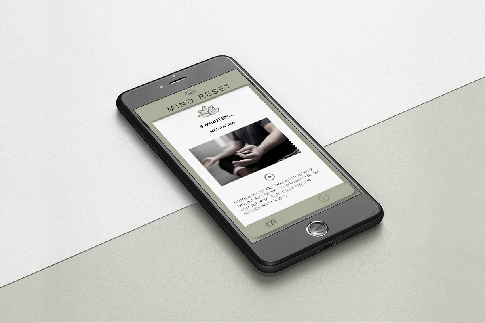

## Motivation

This projekt was create as a part of the Web Development Bootcamp from neuefische GmbH. \
The Mind Reset App gives you short tutorials on how to practise mindfullness in daily buisness.

## Mockup

## Demo

Demo can be found here - [mindereset.app](https://mindreset.vercel.app/)

## Tech Stack

- React
- React Router
- howler.js
- Styled Components
- Storybook

## How to use

`$ npm install`

Installs all packages.

`$ npm start`

Runs the app in the development mode.\
Open [http://localhost:3000](http://localhost:3000) to view it in the browser.

`$ npm run build`

Builds the app for production to the `build` folder.

`$ npm run storybook`

Check out the components.

Thanks for support and the greate time! [neuefische GmbH ](https://github.com/neuefische)
